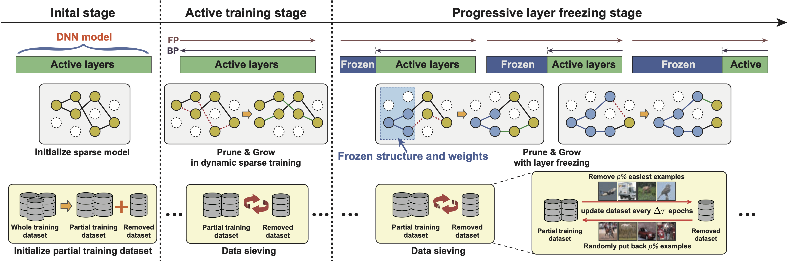

## SpFDE Layer Freezing \& Data Sieving: Missing Pieces of a Generic Framework for Sparse Training

    
Overview of the SpFDE framework. The sparse training  rocess consists of three stages. The initial stage creates a sparse model with a random sparse structure and randomly partitions the training dataset into a partial training dataset and a removed dataset. The active training stage conducts sparse training using the selected sparse training algorithm and periodically update training dataset via data sieving. The progressive layer freezing stage starts to progressively freeze layers in a sequential manner and the frozen layers will not change their sparse structure and weights values.

>Layer Freezing \& Data Sieving: Missing Pieces of a Generic Framework for Sparse Training 
>[Genge Yuan](https://scholar.google.com/citations?user=tBIAgtgAAAAJ&hl)1,2,&dagger;, [Yanyu Li](https://scholar.google.com/citations?view_op=list_works&hl=en&hl=en&user=XUj8koUAAAAJ&sortby=pubdate)1,2,&dagger;,  Sheng Li3, [Zhenglun Kong](https://scholar.google.com/citations?user=XYa4NVYAAAAJ&hl=en)2, [Sergey Tulyakov](http://www.stulyakov.com/)1, [Xulong Tang](http://xzt102.github.io/)3,  [Yanzhi Wang](https://coe.northeastern.edu/people/wang-yanzhi/)2, [Jian Ren](https://alanspike.github.io/)1  
>1Snap Inc., 2Northeastern University, 3University of Pittsburgh

### Abstract

Recently, sparse training has emerged as a promising paradigm for efficient deep learning on edge devices. 
The current research mainly devotes the efforts to reducing training costs by further increasing model sparsity. 
However, increasing sparsity is not always ideal since it will inevitably introduce severe accuracy degradation at an extremely high sparsity level.
This paper intends to explore other possible directions to effectively and efficiently reduce sparse training costs while preserving accuracy.
To this end, we investigate two techniques, namely, layer freezing and data sieving.
First, the layer freezing approach has shown its success in dense model training and fine-tuning, yet it has never been adopted in the sparse training domain.
Nevertheless, the unique characteristics of sparse training may hinder the incorporation of layer freezing techniques.
Therefore, we analyze the feasibility and potentiality of using the layer freezing technique in sparse training and find it has the potential to save considerable training costs.
Second, we propose a data sieving method for dataset-efficient training, which further reduces training costs by ensuring only a partial dataset is used throughout the entire training process.
We show that both techniques can be well incorporated into the sparse training algorithm to form a generic framework, which we dub SpFDE. Our extensive experiments demonstrate that SpFDE can significantly reduce training costs while preserving accuracy from three dimensions: weight sparsity, layer freezing, and dataset sieving. 

 